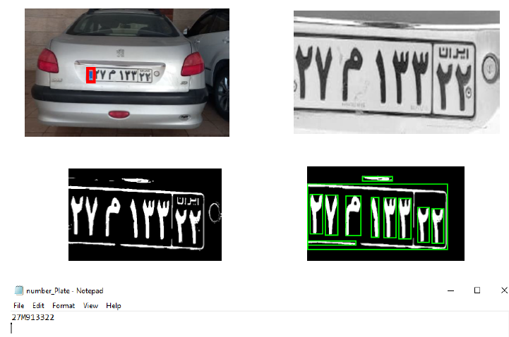

# signal-system-project2
An automated License Plate Recognition (LPR) and OCR system implemented in MATLAB using morphological filtering, character segmentation, and rotation-invariant 2D normalized cross-correlation.

# Signals and Systems — Computer Assignment 2: License Plate Recognition & OCR

This repository contains the full MATLAB implementation, dataset, and complete documentation for Computer Assignment 2 of the **Signals and Systems** course at the **University of Tehran, Faculty of Electrical and Computer Engineering** (Spring 2026), under the instruction of **Dr. Saeid Akhavan**.

**Author:** Seyed Ali Rezaei  
**Student ID:** 810103432  

---

## 📂 Repository Structure & Direct Links

You can access each script, function, and document of this automated recognition pipeline directly via the links below:

* **Documentation:**
  * 📄 [ca2report.pdf](./ca2report.pdf) — Full technical report containing detailed code explanations, algorithmic workflows, and intermediate image processing results.
* **Main Pipeline Execution:**
  * 📜 [main.m](./main.m) — The central script coordinating the entire pipeline from image input to character classification.
* **Custom Modular Functions:**
  * 📜 [mygrayfun.m](./mygrayfun.m) — Custom implementation for converting RGB matrices into normalized grayscale representations.
  * 📜 [mybinaryfun.m](./mybinaryfun.m) — Fixed-threshold logic function converting grayscale intensities into binary (black and white) mask layers.
  * 📜 [myremoveobject.m](./myremoveobject.m) — Morphological filter that cleans up image noise by eliminating connected elements below a specific pixel area threshold.
  * 📜 [mysegmentation.m](./mysegmentation.m) — Labeling and isolation engine used to partition individual characters from the plate matrix.
* **OCR Database:**
  * 📊 [TRAININGSET.mat](./TRAININGSET.mat) — The alphanumeric template database containing pre-loaded structural matrices (`TRAIN`) for letter and number matching.

---

## 📊 Sample Output & Visual Results

Below is the execution result of the computer vision pipeline, demonstrating successful license plate tracking, component bounding-box isolation, and alphanumeric character recognition output:



---

## 🛠️ System Configuration & Requirements

To execute this computer vision and OCR pipeline locally, ensure your environment matches the following criteria:
- **Environment:** MATLAB R2022a or newer (recommended).
- **Required Toolboxes:**
  - *Image Processing Toolbox* (Required for loading images, computing structural properties via `regionprops`, and executing 2D normalized cross-correlations via `normxcorr2`).
- **Input Specifications:** Supports standard image formats including `.jpg`, `.bmp`, `.png`, and `.tif`.

### Execution Instructions
1. Clone this repository to your workstation:
```bash
git clone [https://github.com/sarazaee/signal-system-project2.git](https://github.com/sarazaee/signal-system-project2.git)
